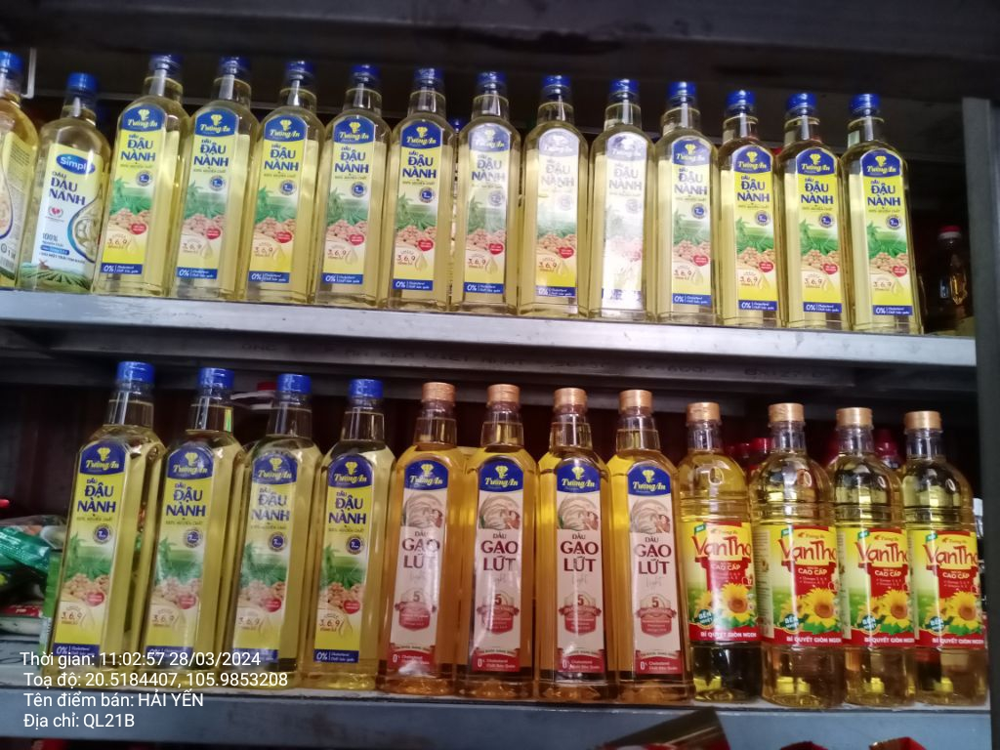
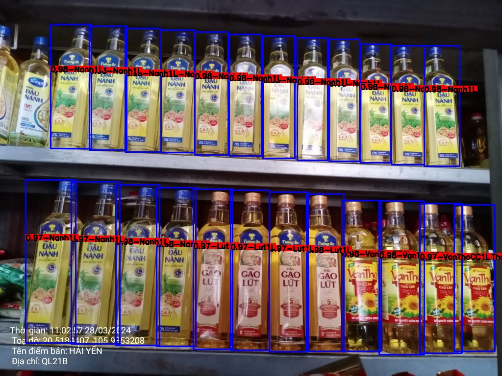
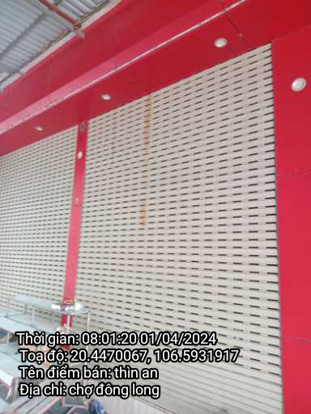
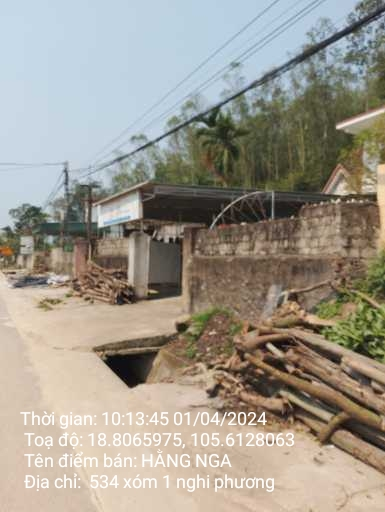
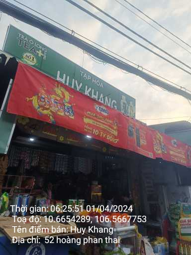

# Overview
<!-- The project exposes 2 apis for detecting products and classifying invalid visiting images -->
This project uses FastAPI as a framwork to build a Web Server. The server supports 2 APIs for purposes:
- Detecting merchandising products in images.
- Classifying valid/invalid visiting images.
<!-- In detecting products, I use YOLOv5 as backbone -->
## Detecting merchandising products
In this task, I use YOLOv5 as a backbone with yolov5s pretrain. The model is trained over 2000 images with 55 classes.

Example:
- Input image
<!--  -->


- Output image
<!--  -->


Beside detecting products, I also detect the layout of them in images. For example:

- API curl:
```
curl --location 'localhost:9033/api/image/detect' \
--header 'Content-Type: application/json' \
--header 'Authorization: Bearer your_key' \
--data '{
    "business": 2,
    "image_url": "your image path"
}'
```
- API output:
```
{
    "error": 0,
    "message": "Success",
    "data": {
        "product": {
            "DAU_NA_1L": 16,
            "GAO_LUT_1L": 4,
            "VTHOCC_1L": 4
        },
        "layout": [
            ["DAU_NA_1L","DAU_NA_1L","DAU_NA_1L","DAU_NA_1L","DAU_NA_1L","DAU_NA_1L","DAU_NA_1L","DAU_NA_1L","DAU_NA_1L","DAU_NA_1L","DAU_NA_1L","DAU_NA_1L"],
            ["DAU_NA_1L","DAU_NA_1L","DAU_NA_1L","DAU_NA_1L","GAO_LUT_1L","GAO_LUT_1L","GAO_LUT_1L","GAO_LUT_1L","VTHOCC_1L","VTHOCC_1L","VTHOCC_1L","VTHOCC_1L"]
        ]
    }
}
```
<!-- Tôi đã thực hiện gán nhã hơn 2000 ảnh với 14 classes.
Cấu hình máy là CPU 4 Cores, RAM 16GB, và GPU RTX 2080 12GB. Batch size là 32 và epochs 600 -->
<!-- In classifying images, I use ViT (Vision Transformer) as backbone -->
## Classifying visiting images
In this task, I use Vision Transformer (ViT) as a backbone with google/vit-base-patch16-224-in21k pretrain. The model is trained over 1222 images with 3 classes (OK/BLANK/CLOSED).

Example:

| Closed shop (CLOSED) | Invalid (BLANK) | Valid (OK) |
|:-------------------------:|:-------------------------:|:-------------------------:|
| |   |  |
```
curl --location 'localhost:9033/api/shop/classify' \
--header 'Content-Type: application/json' \
--header 'Authorization: Bearer your_key' \
--data '{
    "business": 2,
    "image_url": "your image path"
}'
```

```
{
    "error": 0,
    "message": "Success",
    "data": {
        "label": "OK",
        "conf": 0.9999920129776001
    }
}
```